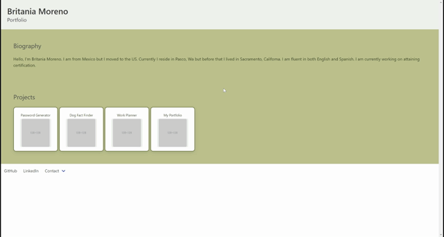

# Practice Portfolio

## Description

An practice of making a portfolic website using HTML and vanilla JavaScript

## How the site should look like

## Help

Any advice for improvement on the design or user experience would be appreciated

## Authors
[BriMoreno](https://github.com/BriMoreno)

## Acknowledgments

* [README-Template](https://gist.github.com/DomPizzie/7a5ff55ffa9081f2de27c315f5018afc)
* [Password Picture](https://images.ctfassets.net/q33z48p65a6w/7GmTIyrf7kNHSyje5E8mxB/aae3dc9e041425ead15b52ecb3e70bab/how-to-make-a-strong-password.png?fit=thumb&fm=webp&h=1005&q=70&w=1920)
* [Dog Picture](https://www.pexels.com/photo/two-yellow-labrador-retriever-puppies-1108099/)
* [Planner](https://www.pexels.com/photo/silver-click-pen-on-open-book-210660/)
* [Clouds](https://www.pexels.com/photo/cloudy-sky-531756/)
